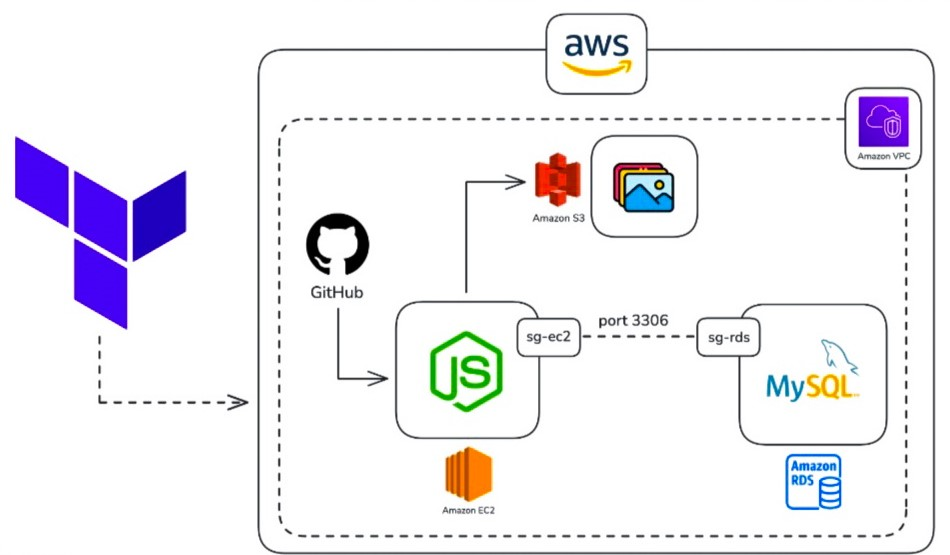
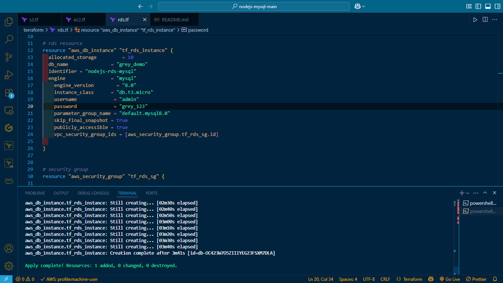
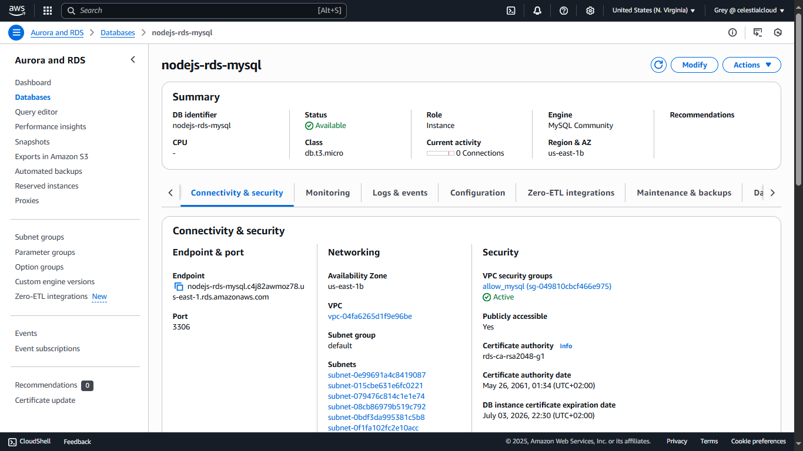
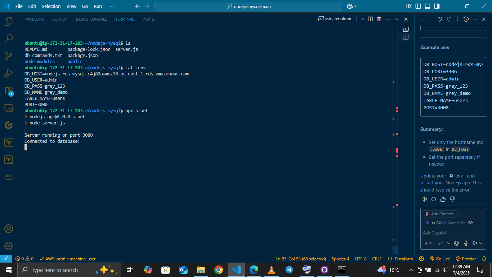
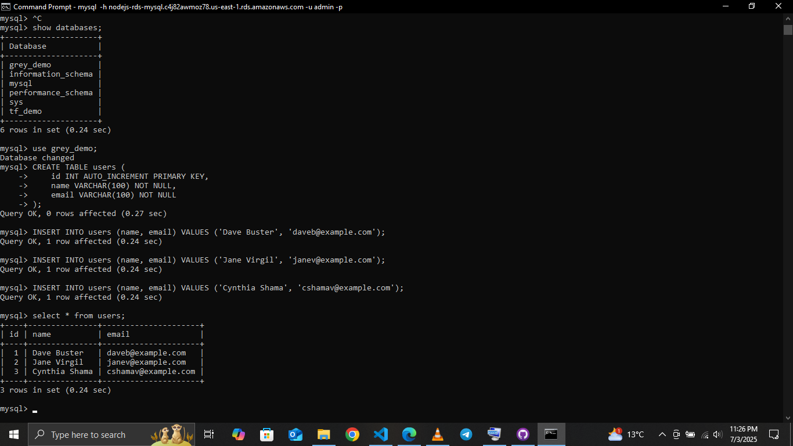
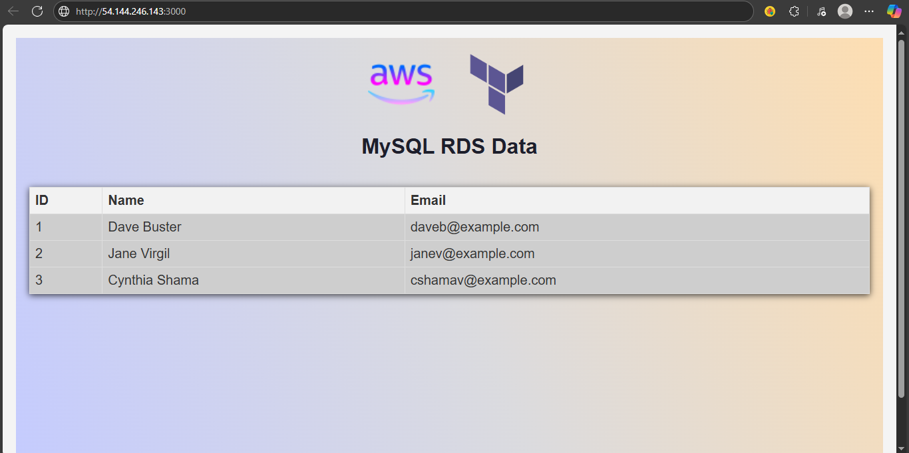

# ☁️ AWS Infrastructure with Terraform – Node.js App Deployment

This project provisions a fully automated AWS cloud infrastructure using **Terraform**, designed to host a **Node.js application** backed by **MySQL (RDS)** and **S3** for storage. The entire setup is containerized in a **secure, modular architecture** using Terraform best practices and AWS Free Tier–friendly resources.

---

## 🧠 What This Project Covers

- Infrastructure-as-Code (IaC) using **Terraform**
- Secure deployment of a **Node.js** app on **EC2**
- Provisioning of **Amazon RDS (MySQL)** for database needs
- File storage using **Amazon S3**
- Network isolation with **VPC** and **custom security groups**
- Modularized Terraform code (especially EC2 security groups)
- Documentation with architecture diagram & screenshots

---

## 📐 Architecture Flow

1. GitHub hosts the Node.js application code.
2. Terraform provisions:
   - An **EC2 instance** to host the app
   - A **MySQL RDS database**
   - An **S3 bucket** for file storage
   - Custom **security groups** with port-based restrictions
3. The Node.js app connects securely to the RDS on **port 3306**.
4. The app interacts with S3 for file upload/download
5. Everything runs within the default **VPC** for isolation.

---

## 🖼️ Architecture Diagram

Image Source: @kverma_ (adapted and customized)

---

## 🛠️ Tools & Technologies

| Tool | Purpose |
|------|---------|
| **Terraform** | IaC – infrastructure provisioning |
| **AWS EC2** | Hosts Node.js app |
| **AWS RDS (MySQL)** | Database |
| **AWS S3** | File storage |
| **VPC & Security Groups** | Network isolation & access control |
| **GitHub** | Code and project repository |

---

## 📁 Project Structure

project-root/
├── terraform/
│ ├── main.tf
│ ├── variables.tf
│ ├── outputs.tf
│ ├── provider.tf
│ └── modules/
│ └── ec2-security-group/
│ ├── main.tf
│ └── variables.tf
├── screenshots/
│ ├── ec2-instance.png
│ ├── rds-setup.png
│ ├── s3-bucket.png
├── architecture/
│ └── architecture-diagram.png
├── README.md

Before deploying, I ensured the following were set up:

- ✅ An [AWS Free Tier](https://aws.amazon.com/free) account
- ✅ AWS CLI installed and configured with `aws configure`
- ✅ Terraform installed (`terraform -v`)
- ✅ An IAM user with programmatic access and permissions to provision EC2, RDS, S3, and VPC resources

---

#### Provision resources and security groups

###### 🔐 Security & Access Control
- ###### sg-ec2: Allows inbound HTTP (port 3000) and SSH (port 22) access to the EC2 instance.
- ##### sg-rds: Restricts MySQL access (port 3306) to only the EC2 instance.

1️⃣ Initialize Terraform
    terraform init
2️⃣ Review plan
   terraform plan
3️⃣ Provision infrastracture
terraform apply

---

###### ⚙️ EC2 Instance: Automated App Setup

As soon as the EC2 instance is provisioned, a `user_data` script is executed to automatically install Node.js, clones the app from GitHub, configures environment variables using RDS outputs, installs dependencies, and starts the Node.js app — all during EC2 provisioning.

#### SSH into my EC2 Instance
ssh -i C:\Users\Thabo\.ssh\tf_greykeypair.pem ubuntu@54.162.183.106

#### Connect to MySQL (RDS) and add more data

mysql -h nodejs-rds-mysql.c4j82awmoz78.us-east-1.rds.amazonaws.com -u admin -p

#### Test App in Browser
Visit: http://54.144.246.143:3000

#### Destroy Infrastructure
terraform destro

#### 🧠 What I Learned
- Designing cloud infra with security-first approach
- Modularizing Terraform code for reuse
- Connecting Node.js to MySQL via secure SGs
- Provisioning with Terraform from scratch

 #### Read blog post [Here](https://greystack.hashnode.dev/how-i-built-a-fully-automated-aws-infrastructure-with-terraform-to-deploy-a-nodejs-app-free-tier-friendly)

Diagram concept inspired from @verma-kunal
